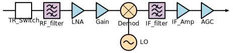
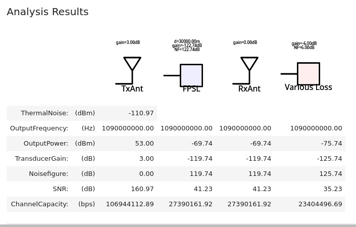
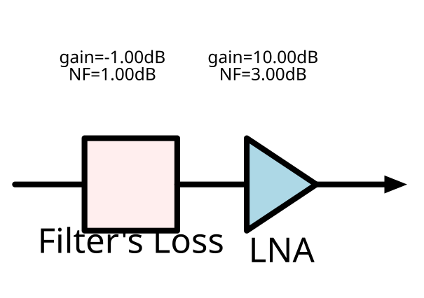
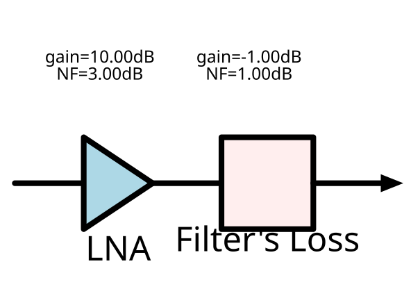

# RF Budget Toolbox

A simple python toolbox for RF Budget Analysis.

Objectives are:

* for me to understand the formulas,
* having something visual to play with under Jupyter Notebook,
* having an open source alternative to [commercial products](#commercial-products-alternatives)

## Features

- [x] Gain
- [x] SNR
- [ ] OIP2
- [x] OIP3
- [x] Free space loss
- [x] SVG export with [SchemDraw](https://schemdraw.readthedocs.io)
- [x] Visual rendering under Jupyter Notebook
- [ ] Interactive Jupyter Notebook

## Examples

Some examples can be found in [their own repository](examples/) but also in [unit tests](./tests/).

[](./examples/test1.py)
[](./examples/adsb.ipynb)

But to start with, here is a simpler one.
Let's imagine you have one filter with one 1dB loss, and an amplifier with 10dB of gain, but 3dB of noise figure. How is it best to sequence them?




```python
from rfbudget import *

the_filter = Loss(name="filter", loss=dB(1))

a1 = Amplifier(
    name='LNA',
    gain=10,
    nf=3,
)
```

Let's do the first computation:

```python
b1 = budget(
    elements=[the_filter, a1],
    input_freq=MHz(144),
    available_input_power=0,
    signal_bandwidth=kHz(1),
    without_oip=True
)

b1.display()
```

It will display:

```txt
rfbudget with properties:
Elements: [1x2 rf.internal.rfbudget.Element]
InputFrequency: 144000000.0 Hz
AvailableInputPower: 0  dBm
SignalBandwidth: 1000.0 Hz
Solver: Friis

Analysis Results
ThermalNoise:    (dBm)    -143.97722915699808
OutputFrequency: (Hz)    [144000000.0, 144000000.0]
OutputPower:     (dBm)   [-1, 9]
TransducerGain:  (dB)    [-1, 9]
Noisefigure:     (dB)    [1.0000000000000002, 4.0]
SNR:             (dB)    [142.97722915699808, 139.97722915699808]
ChannelCapacity: (bps)   [47496.007446578056, 46499.42901811185]
```

It returns a noise figure of 4dB at the output.
Similarly one can compute, the other sequence and get 3dB.
Obvious result for those in the field but nice to compute and understand. ;-)

## Source of inspiration

* http://www.diva-portal.org/smash/get/diva2:1371826/FULLTEXT01.pdf
* https://en.wikipedia.org/wiki/Friis_formulas_for_noise
* https://www.microwaves101.com/encyclopedias/noise-figure-one-and-two-friis-and-ieee
* https://www.commagility.com/images/pdfs/white_papers/Introduction_to_RF_Link_Budgeting_CommAgility.pdf
* https://www.youtube.com/watch?v=piIujfV3Nsw&list=PLGF140BA5wtWgW9bAd6DtF3MaYbhPtFwd
* https://pysdr.org/content/link_budgets.html
* https://markimicrowave.com/technical-resources/tools/ip3-intermodulation-calculator/
* http://edadownload.software.keysight.com/eedl/ads/2011_01/pdf/rfsysbudget.pdf

* https://link-budget.readthedocs.io
* https://github.com/cfragoas/SatLink


## Commercial products alternatives

* [ADIsimRF](https://www.analog.com/en/design-center/adisimrf.html)
* [ Cascade Analysis Python Script](https://kb.awr.com/display/awrscripts/Cascade+Analysis+Python+Script)
* [MATLAB RF Toolbox™](https://fr.mathworks.com/help/rf/index.html?s_tid=CRUX_lftnav)
* [Signal Chain Explorer](https://robustcircuitdesign.com/signal-chain-explorer/)